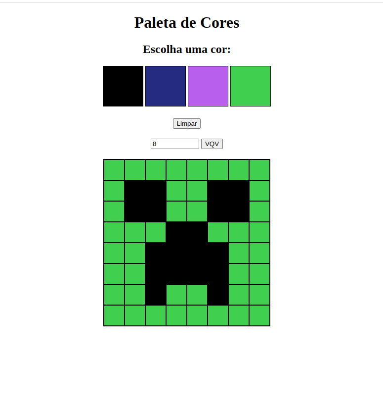

# Pixel Art
Projeto pixel art

Um dos primeiros projetos (se não o primeiro) com interação que desenvolvi.  
Nele é possível pintar um quadro de pixels com cores aleatórias que surgem a cada recarregamento de página.
Também é possivel redimensionar o tamanho do quadro.

Tela da aplicação:

